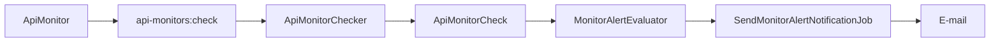

# Inspector

Monitore a saúde das suas APIs HTTP, acompanhe histórico de checks e receba alertas por e-mail quando algo sai do esperado.

<p align="center">
  
  
  
  
  
  
</p>

---

## O que faz

O **Inspector** é uma aplicação web para **monitoramento de APIs**: você cadastra endpoints, define intervalo e autenticação, e o sistema verifica periodicamente disponibilidade, status HTTP e latência.

| Recurso | Descrição |
| --- | --- |
| **Monitoradores de API** | Crie e edite monitores com URL, método, headers, auth e intervalo (10s / 30s / 60s) |
| **Checks automáticos** | O scheduler dispara `api-monitors:check` a cada 10 segundos para monitores vencidos |
| **Histórico** | Log paginado de cada probe: status, latência, preview do body e erros |
| **Alertas** | Regras por disponibilidade, status code ou tempo de resposta, com cooldown |
| **Notificações** | Canais de e-mail com verificação por OTP e inscrição por alerta |
| **Cancelar inscrição** | Link público com token para o destinatário sair da lista |

> **Webhook Inspector** aparece na navegação como módulo futuro — as páginas ainda são placeholder.

---

## Stack

| Camada | Tecnologia |
| --- | --- |
| Backend | Laravel 13, PHP 8.5, Fortify (auth + 2FA) |
| Frontend | Inertia.js v3, React 19, TypeScript, Vite, Tailwind CSS 4 |
| Dados | PostgreSQL 18 |
| Cache / fila / sessão (prod) | Redis |
| Reverse proxy (prod) | Caddy (TLS) |
| Local | Laravel Sail (`compose.yaml`) |
| Produção | Docker multi-stage + `compose.prod.yaml` + `Makefile` |

---

## Fluxo de monitoramento



1. Você cria um monitorador (check manual imediato na criação).
2. O scheduler revalida monitores devidos.
3. Cada resultado atualiza o status do monitor e o histórico.
4. Regras de alerta disparam (ou recuperam) e enfileiram o e-mail.

---

## Desenvolvimento local (Sail)

Requisitos: Docker e Docker Compose.

```bash
cp .env.example .env
vendor/bin/sail up -d
vendor/bin/sail composer install
vendor/bin/sail artisan key:generate
vendor/bin/sail artisan migrate
vendor/bin/sail npm install
vendor/bin/sail composer run dev
```

Alternativa one-shot (após o Sail estar no ar):

```bash
vendor/bin/sail composer setup
```

A aplicação sobe em `http://localhost` (porta `APP_PORT`, padrão `80`).

Serviços do Sail: app PHP, PostgreSQL, Redis, Mailpit e RabbitMQ.

Para checks e alertas de verdade no local, mantenha **queue worker** e **scheduler** rodando (o `composer run dev` / `artisan dev` já orquestra o fluxo de desenvolvimento).

### Usuário de seed

Após `db:seed`, há um usuário de teste: `test@example.com` (senha da factory padrão do Laravel).

---

## Produção

Produção usa um Compose **separado** do Sail (`inspector-prod`), para não colidir com o ambiente local.

```bash
cp .env.production.example .env.production
# Preencha APP_KEY, DOMAIN, DB_PASSWORD, APP_URL, MAIL_*, etc.

make prod-up
# equivalente: ./bin/prod up -d --build
```

### Serviços

| Serviço | Função |
| --- | --- |
| `caddy` | Proxy reverso + TLS |
| `app` | PHP-FPM + Nginx (migrations no boot se `RUN_MIGRATIONS=true`) |
| `queue` | `queue:work` |
| `scheduler` | `schedule:work` |
| `pgsql` / `redis` | Banco e cache/fila/sessão |

### Comandos úteis

```bash
make prod-ps
make prod-logs                 # logs do app
make prod-logs SERVICE=queue
make prod-shell
make prod-artisan ARGS="migrate --force"
make prod-down
```

Ou via wrapper:

```bash
./bin/prod ps
./bin/prod logs -f app
```

Variáveis importantes em `.env.production` (sem segredos): `APP_URL`, `DOMAIN`, `DB_*`, `SESSION_DRIVER=redis`, `QUEUE_CONNECTION=redis`, `CACHE_STORE=redis`, `TRUSTED_PROXIES`, `HTTP_PORT` / `HTTPS_PORT`.

---

## Qualidade

```bash
# Suite PHP (Pint + PHPStan + Pest)
vendor/bin/sail artisan test --compact
# ou: vendor/bin/sail composer test

# Frontend
vendor/bin/sail npm run lint:check
vendor/bin/sail npm run format:check
vendor/bin/sail npm run types:check

# CI local completo
vendor/bin/sail composer ci:check
```

---

## Estrutura (visão rápida)

```
app/
  Console/Commands/     # api-monitors:check
  Http/Controllers/     # ApiInspector, Settings, Unsubscribe
  Jobs/                 # notificações de alerta
  Models/               # monitors, checks, alerts, channels
  Services/             # checker + avaliação de alertas
resources/js/
  pages/ApiInspector/   # listagem, create, show, alertas
  components/base/ApiConsulting/
docker/                 # nginx, php, supervisord, entrypoint
compose.yaml            # Sail (local)
compose.prod.yaml       # stack de produção
Makefile                # atalhos de produção
```

---

## Conceitos do domínio

| Conceito | Significado |
| --- | --- |
| **ApiMonitor** | Endpoint monitorado (URL, método, auth, intervalo, status esperado) |
| **ApiMonitorCheck** | Resultado de um probe (`success` / `warning` / `error`) |
| **MonitorAlert** | Regra vinculada a um monitor |
| **NotificationChannel** | Destino de notificação (hoje: e-mail verificado) |
| **AlertSubscription** | Liga alerta ↔ canal, com token de unsubscribe |

---

## Licença

MIT
